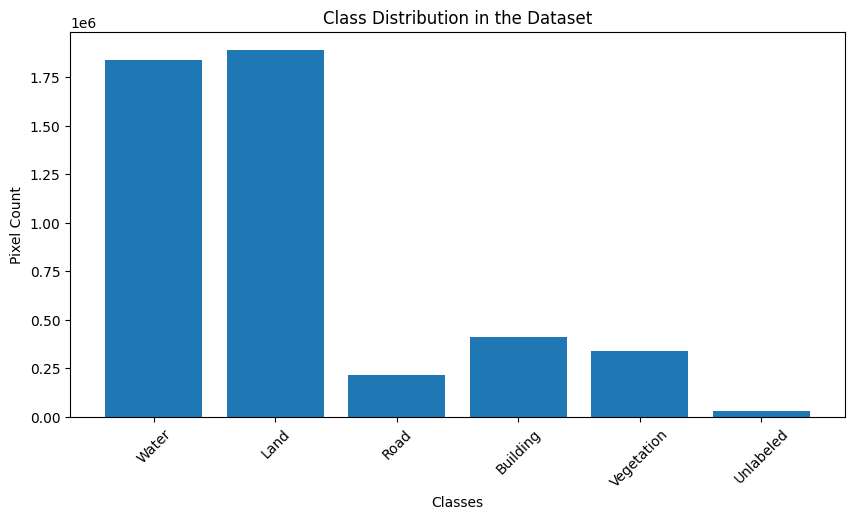
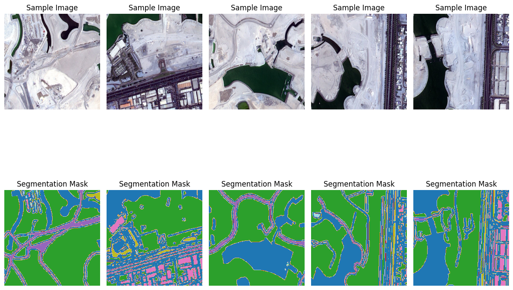
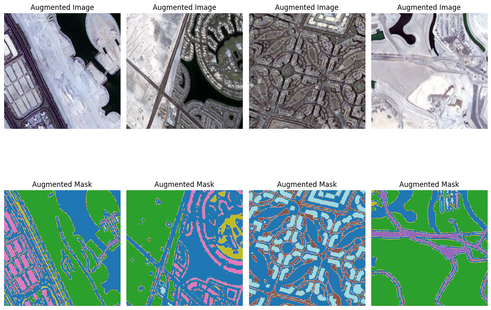
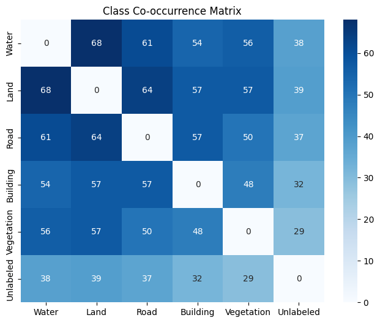
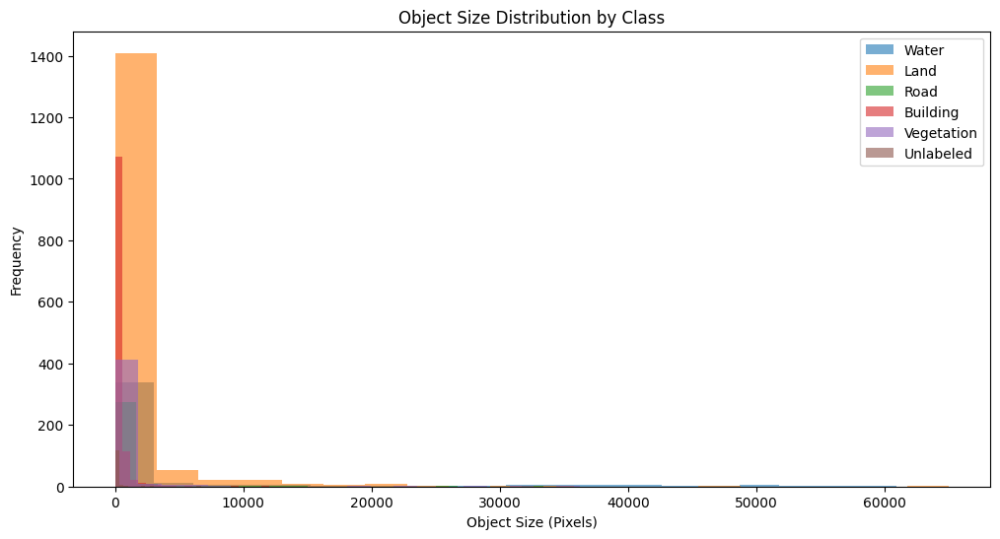
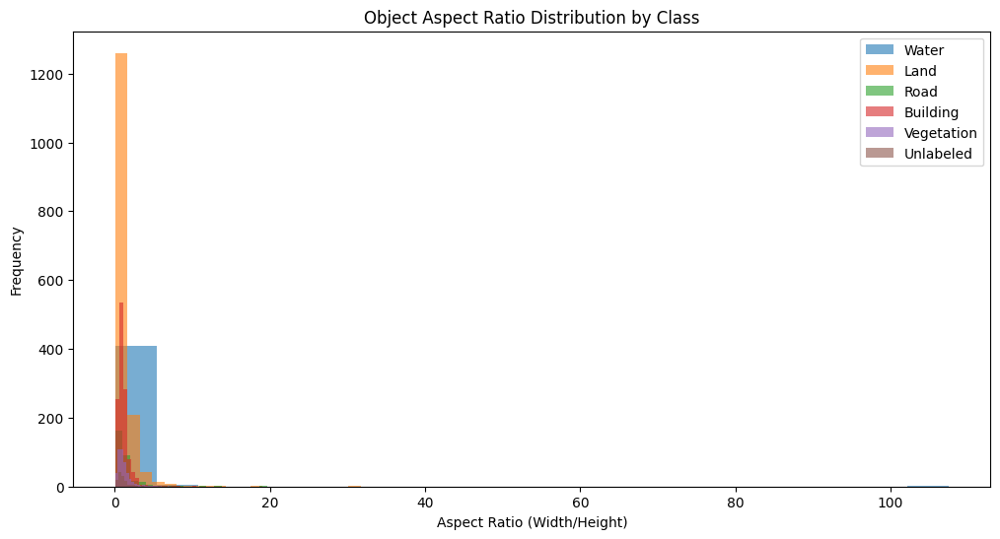
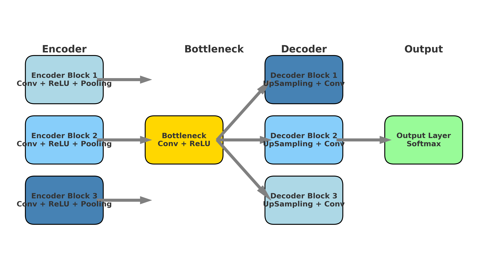
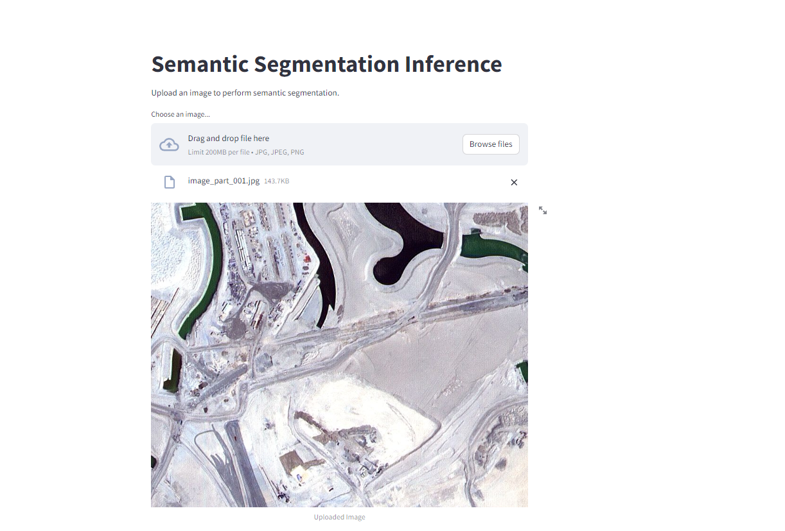
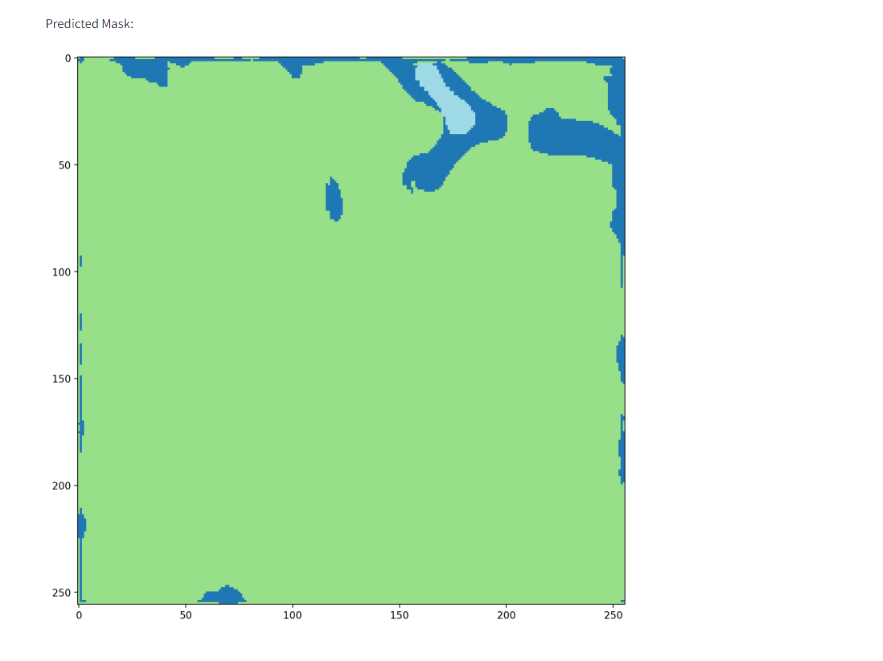
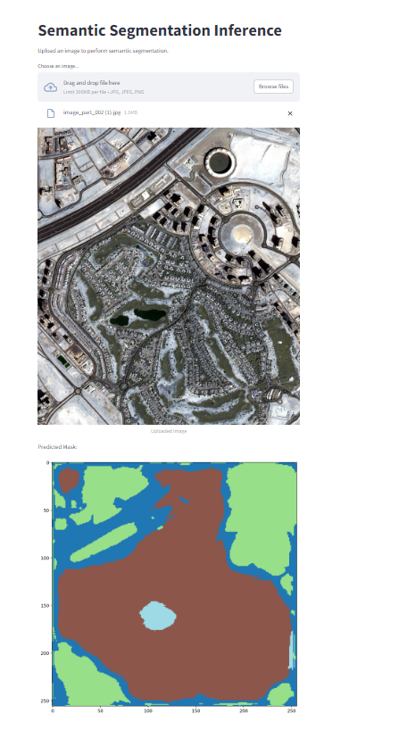

# <b>Semantic Segmentation Using U-NET for or Architectural Data</b>

## <b>Problem Statement</b>
Semantic segmentation involves classifying each pixel in an image into a specific category. In the context of satellite imagery, this task is crucial for understanding and managing large-scale environments, including urban planning, resource management, disaster response, and environmental monitoring. Our goal is to create a model that can accurately segment various land types, such as water, land, roads, buildings, and vegetation, from satellite images.

- <b>Real-Life Problem:</b> Imagine a situation where a city is planning to expand its infrastructure. The urban planners need precise information on available land, existing roads, water bodies, and buildings to make informed decisions. Traditionally, this would require manual inspection of maps and satellite images, a time-consuming and error-prone process. Our solution aims to automate this process by providing pixel-level annotations of satellite images, thus offering a faster, more accurate, and scalable solution.

---
## <b>Exploratory Data Analysis (EDA)</b>

Understanding the dataset is the first step toward building a successful model. The dataset used here consists of high-resolution satellite images, each annotated with six classes: water, land, road, building, vegetation, and unlabeled. Here's a brief overview of the dataset:

- <b>Class Distribution:</b> The distribution of pixel counts across classes shows that most images are dominated by vegetation and land, while classes like roads and buildings are less frequent. This class imbalance is an important factor that we need to address during model training.

<p align="center">
  
</p>


- <b>Sample Images and Masks:</b> Below are some sample images and their corresponding segmentation masks. The images have been resized to a uniform size for consistency during model training.

<p align="center">
  
</p>


- <b>Augmentation Visualization:</b> Given the limited diversity in the dataset, we applied various data augmentation techniques such as rotation, width and height shifts, shear, and zoom. The images below show examples of augmented images and their corresponding masks.

<p align="center">
  
</p>

- <b>Co-occurrence Analysis:</b> We performed a co-occurrence analysis to understand which classes often appear together in the same image. This helps in understanding the spatial relationships between classes, which can be useful for the model to learn complex patterns.

<p align="center">
  
</p>

- <b>Object Size and Aspect Ratio:</b> Analyzing object sizes and aspect ratios helps us understand the scale of different objects in the images. This analysis is crucial for deciding the receptive field of the network layers and improving the model's performance in recognizing small or large objects.

<p align="center">
  
</p>


<p align="center">
  
</p>

---
## <b>Architecture Overview:</b>

```
+---------------------------------------------+
|         Data Loading and Preprocessing      |
|  - Load images and corresponding masks      |
|  - Normalize and resize images and masks    |
|  - Optional data augmentation               |
+---------------------------------------------+
                      |
                      V
                Input Image
                      |
                      V
+---------------------------------------------+
|               U-Net Encoder                 |
|                                             |
|  [Block 1]                                  |
|   - Conv2D + ReLU                           |
|   - Conv2D + ReLU                           |
|   - MaxPooling2D                            |
|                                             |
|  [Block 2]                                  |
|   - Conv2D + ReLU                           |
|   - Conv2D + ReLU                           |
|   - MaxPooling2D                            |
|                                             |
|  ... (Repeated blocks)                      |
|                                             |
|  [Block N]                                  |
|   - Conv2D + ReLU                           |
|   - Conv2D + ReLU                           |
|   - MaxPooling2D                            |
+---------------------------------------------+
                      |
                      V
             Bottleneck Layer
             - Conv2D + ReLU
             - Conv2D + ReLU
                      |
                      V
+---------------------------------------------+
|               U-Net Decoder                 |
|                                             |
|  [Up Block N]                               |
|   - UpSampling2D                            |
|   - Concatenate with Encoder Block N output |
|   - Conv2D + ReLU                           |
|   - Conv2D + ReLU                           |
|                                             |
|  ... (Repeated blocks)                      |
|                                             |
|  [Up Block 1]                               |
|   - UpSampling2D                            |
|   - Concatenate with Encoder Block 1 output |
|   - Conv2D + ReLU                           |
|   - Conv2D + ReLU                           |
+---------------------------------------------+
                      |
                      V
              Output Layer
            - Conv2D (1x1 kernel)
            - Softmax Activation
                      |
                      V
              Segmentation Map

```

---

<p align="center">
  
</p>

---
## <b>Techniques Explained</b>
- <b>Data Augmentation:</b> Techniques like rotations, zooms, and flips are applied to increase data diversity and improve model robustness.
- <b>Advanced U-Net:</b> Includes dropout and batch normalization to prevent overfitting and accelerate convergence.
- <b>Early Stopping and Learning Rate Scheduling:</b> Helps in finding the optimal model configuration without overfitting.
- <b>Co-occurrence and Object Analysis:</b> Understanding object distributions informs better model design and parameter tuning.

---

## <b>Run and Streamlit Application</b>
A user-friendly Streamlit app allows real-time inference on uploaded images. The model generates a segmented mask, providing a visual representation of various land types.

---

### <b>How to Run the Project</b>

```
git clone https://github.com/yourusername/semantic-segmentation-satellite.git
cd semantic-segmentation-satellite
pip install -r requirements.txt
```

### <b>Preprocess Data:</b>


```
python src/data_loader.py --config config.yaml

```
### <b>Train the Model:</b>


```
python src/train.py --config config.yaml --epochs 30 --batch_size 8
```
### <b>Evaluate and Visualize:</b>


```
python src/visualize.py --config config.yaml --model_path output/logs/best_model.h5
```
### <b>Run Streamlit App</b>

```
streamlit run streamlit_app.py -- --config config.yaml --model_path output/logs/best_model.h5
```

## <b>Inference Result</b>:

<p align="center">
  
</p>

---

## <b>streamlit app Result</b>:

<p align="center">
  
</p>

<p align="center">
  
</p>

---

<p align="center">
  
</p>

---

### Key Points for improvement:
1. **Inference Results**: Mentioned the current performance and challenges.
2. **Training Improvements**: Suggested training for more epochs.
3. **Data Increase**: Highlighted the importance of gathering more data.
4. **Pretrained Models**: Recommendation to use pretrained backbones.
5. **Hyperparameter Tuning**: Suggested fine-tuning various hyperparameters.
6. **Augmentation Strategies**: Advanced augmentation techniques for better generalization.
7. **Post-Processing**: Introduced the concept of CRFs for refinement.
8. **Ensemble Learning**: Suggested using multiple models for improved results.


## <b>Conclusion</b>

This project demonstrates an end-to-end solution for semantic segmentation of satellite images. From data preprocessing and EDA to model training and deployment, we provide a comprehensive pipeline. The modular design allows easy modifications and scalability for future improvements. Contributions and suggestions are welcome to make this solution even more robust and versatile.
